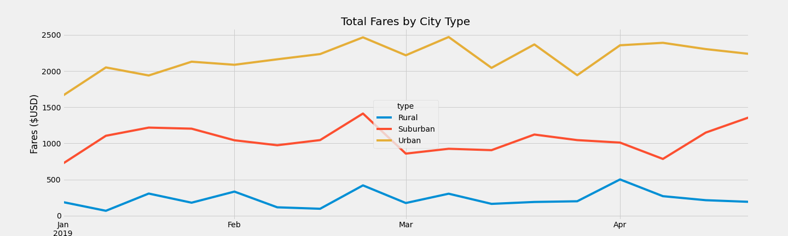

# PyBer_Analysis
UNC Module 5

## Overview
This analysis was conducted to review the differences in PyBer usage in three types of geographic areas: urban, suburban, rural.  The data covered the first five months of 2019 and provided driver counts, ride counts, and fare amounts.

## Data Review Results

•	The total ride count showed that the urban area, with 1,625 rides, had the highest total by a large amount.  The suburban area had less than half that total, with 625 rides recorded, and the rural area only had 125 rides.

•	The driver count corresponded with the population of the areas.  The rural area only accounted for 78 drivers.  The suburban area had 490 and the urban area had 2,405.

•	Total fares were also indicative of the number of rides in each area, with the urban area having the highest total, $39,854.38, and the rural showing $4,327.93.  The suburban area came in at $19,356.33.

•	The average fare per ride showed a difference of $24.53 for urban, $30.97 for suburban, and $34.63 for the rural area.  

•	There was a large difference in the average fare per driver.  The average for an urban driver was $16.57, while the suburban driver average $39.50.  The rural drive had a higher average then either of them at $55.49

 

•	A subset of data was pulled for additional analysis.  The total fares by week and city type were plotted to provide a visual view of the data.  The graph shows a peak in each city type around the same time, which may be holiday or weather related. 

## Data Summary
•	There are additional metrics which could be helpful in determining the cause of the disparities between the different areas.  A review of miles per ride would assist in explaining the difference in the average fares per driver.  The rural areas may have longer routes, which would mean higher cost per trip.

•	The rural and suburban areas could benefit from more outreach to increase the customer base, along with adding more drivers.

•	There were some urban drivers who did not have a ride listed in the data.  The drivers may no longer be active or may have problems getting riders.  This should be look at to either clean up the data or provide support to the employees.
